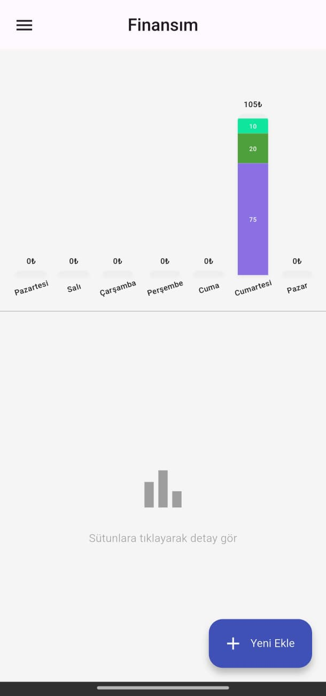
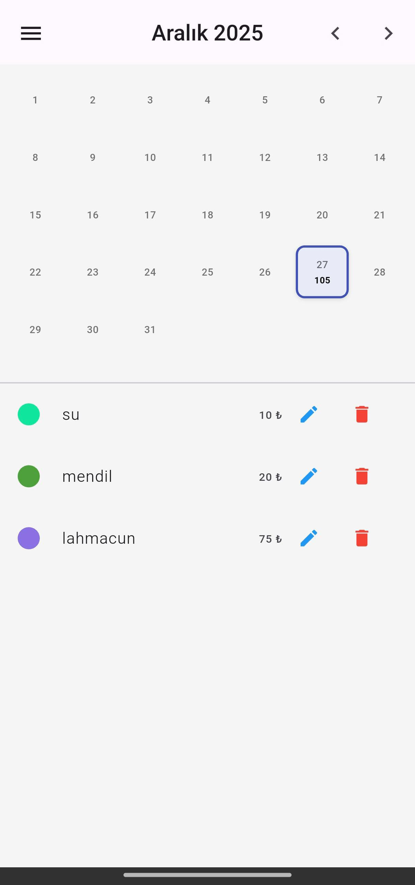

# 💰 Finanscım

Finanscım, kişisel harcamalarınızı ve gelirlerinizi kolayca takip etmenizi sağlayan, Flutter ile geliştirilmiş modern bir finans yönetim uygulamasıdır.

## ✨ Özellikler

- **Harcama ve Gelir Takibi:** Günlük işlemlerinizi hızlıca kaydedin.
- **Görsel İstatistikler:** Harcamalarınızı grafikler (Bar Chart) üzerinden analiz edin.
- **Aylık Görünüm:** Geçmişe dönük aylık finansal özetlerinizi görüntüleyin.
- **Widget Desteği:** Ana ekran widget'ı ile bakiyenizi anlık takip edin.
- **Güvenli Depolama:** Verileriniz SQLite ile cihazınızda güvenli bir şekilde saklanır.

## 📸 Uygulama İçi Görüntüler

<p align="center">
  
  &nbsp;&nbsp;&nbsp;&nbsp;
  
</p>

## 🛠️ Kullanılan Teknolojiler

- **Flutter & Dart**
- **SQLite (sqflite):** Yerel veritabanı yönetimi.
- **FL Chart:** Dinamik veri görselleri.
- **Home Widget:** Android/iOS ana ekran entegrasyonu.
- **Intl:** Tarih ve para birimi formatlama.

## 🚀 Kurulum

1. Depoyu klonlayın:
   ```bash
   git clone https://github.com/kullaniciadi/finanscim.git
   ```
2. Bağımlılıkları yükleyin:
   ```bash
   flutter pub get
   ```
3. Uygulamayı çalıştırın:
   ```bash
   flutter run
   ```

---
*Bu proje kişisel finans takibini kolaylaştırmak amacıyla geliştirilmiştir.*
